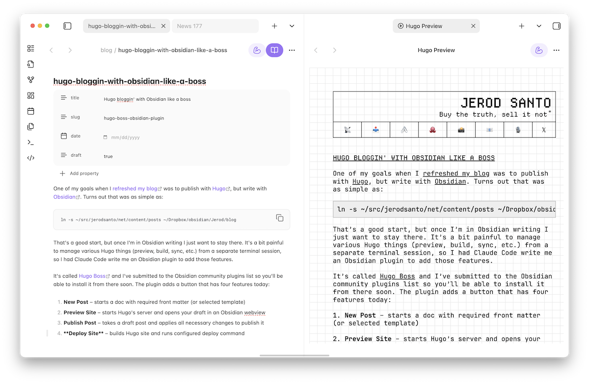

One of my goals when I [refreshed my blog](https://jerodsanto.net/2025/12/is-this-thing-still-on/) was to publish with [Hugo](https://gohugo.io), but write with [Obsidian](https://obsidian.md). Turns out that was as simple as:

```
ln -s ~/src/jerodsanto/net/content/posts ~/Dropbox/obsidian/Jerod/blog
```

That's a good start, but once I'm writing in Obsidian... I don't exactly want to leave. There's friction when managing various Hugo tasks from a separate terminal session. So, I had Claude Code write me an Obsidian plugin to add those features.

It's called [Hugo Boss](https://github.com/jerodsanto/hugo-boss)[^1] and I submitted it to the Obsidian community plugins list, so hopefully you'll be able to install it from there soon[^2]. The plugin adds a button that has four features today:

1. **New Post** – starts a doc with required front matter (or selected template)
2. **Preview Site** – starts Hugo's server and opens your draft in a webview
3. **Publish Post** – applies all necessary changes to publish a post
4. **Deploy Site** – builds Hugo site and runs configured deploy command

Here's what it looks like in use. Blog post on the left. Preview on the right.



So far these four features are all I've needed to feel productive with this setup. But, if there are other ideas that would make this even more *boss*, [PRs welcome](https://github.com/jerodsanto/hugo-boss/pulls)!

[^1]: "Remember when people used to say *boss*, when they were describing something that was really cool?" 
[^2]: However, there are currently [957 open PRs](https://github.com/obsidianmd/obsidian-releases/pulls) to that repo, so it may be awhile...
