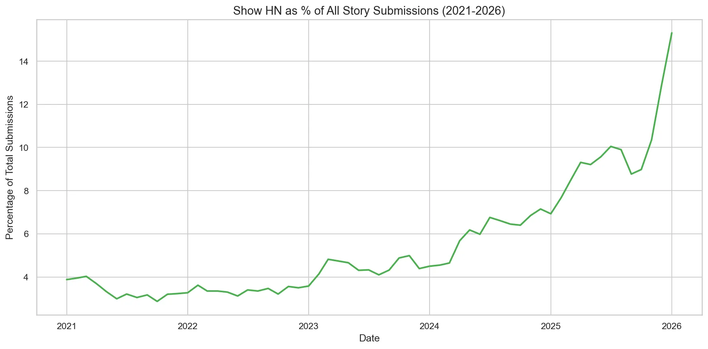

In September of last year, I [covered](https://changelog.com/news/160) a post by Mike Judge arguing that [AI coding claims don't add up](https://mikelovesrobots.substack.com/p/wheres-the-shovelware-why-ai-coding), in which he asked this question:

> If so many developers are so extraordinarily productive using these tools, **where is the flood of shovelware**? We should be seeing apps of all shapes and sizes, video games, new websites, mobile apps, software-as-a-service apps — we should be drowning in choice. We should be in the middle of an indie software revolution. We should be seeing 10,000 Tetris clones on Steam.

At the time, I found Mike's rhetorical question compelling. Not necessarily convincing, but compelling. We really weren't seeing a flood of new wares yet. Some of us had our [shovels out](https://justin.searls.co/links/2025-09-08-i-ve-got-your-shovelware-right-here/), but not in the numbers you'd expect for a truly revolutionary new technology[^1].

Fast forward to last week, when Pete Goldsmith discovered that [Show HN posts per month more than doubled in the last year](https://petegoldsmith.com/2026/01/26/2026-01-26-show-hn-trends/):

> After building some things recently using LLMs and agent workflows, I was noticing more ‘Show HN’ posts. Assuming there had been a rise in folks building things, but wanting to rule out confirmation bias, I looked at the numbers.

Turns out, the numbers[^2] resemble HN's favorite shape: 🏒

This, to me, looks like the canary in the coal mine; the bellwether leading the flock; the first swallow of summer; the... you get the idea. 

We may soon be overwhelmed by [weekend projects](https://rselbach.com/your-sub-is-now-my-weekend-project), [adequate software](https://worksonmymachine.ai/p/the-great-flood-of-adequate-software), and [home-cooked meals](https://www.robinsloan.com/notes/home-cooked-app/). The shovelware cometh. And it might change everything.

[^1]: I think this can be explained by a few factors. a) the tools needed to improve, b) we suck at shipping, and c) we were just starting to cook.

[^2]: This is likely conservative, too, because many people promote their new projects without doing a proper "Show HN" post.