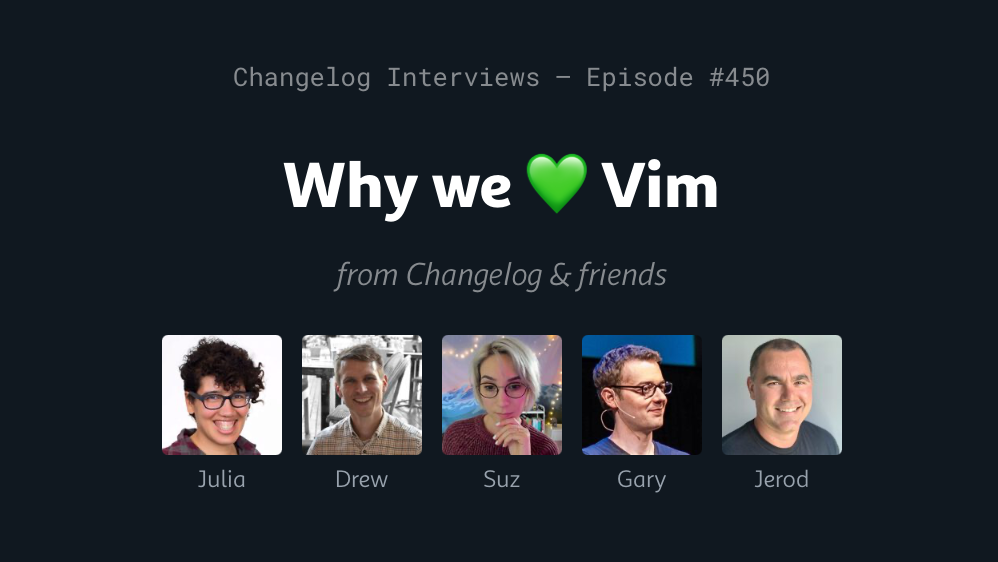
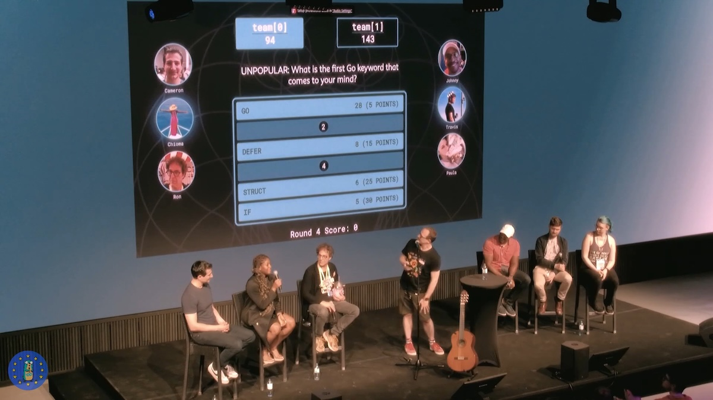
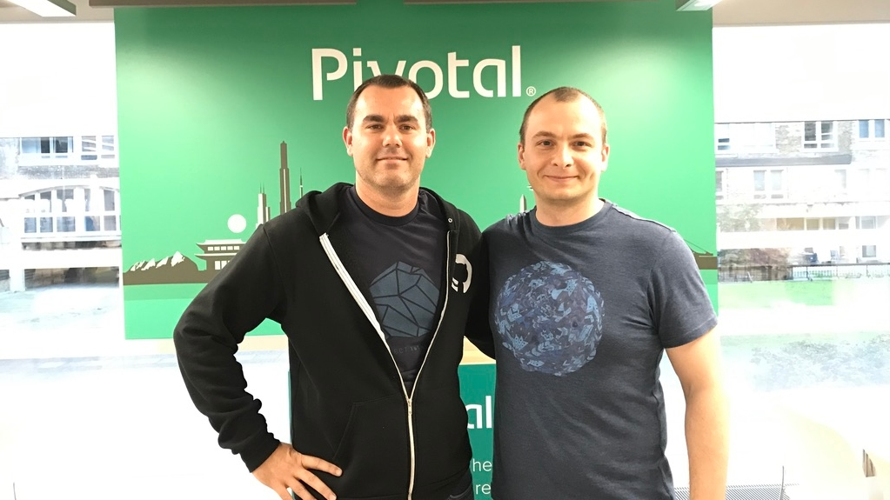
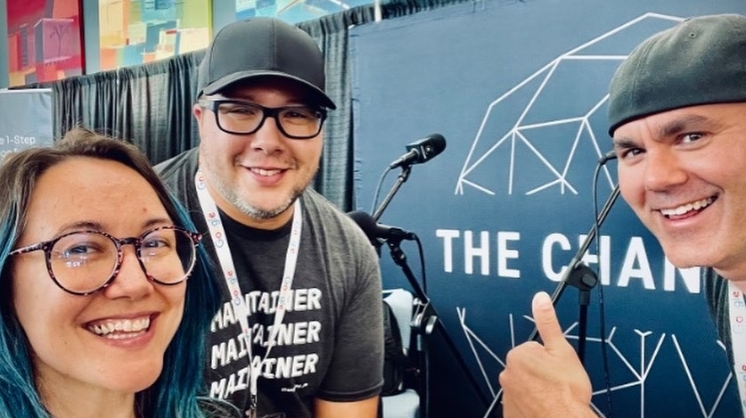
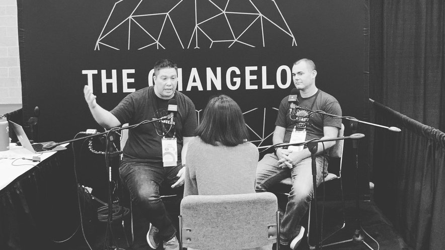

After 13 [years](https://jerodsanto.net/2013/04/changeloggin/), 1042 [podcasts](https://changelog.com/person/jerodsanto), 452 newsletters, and countless friends made along the way... it's time to say goodbye to The Changelog. I shipped my [final News](https://changelog.com/news/182) last Monday and Adam shipped our [Friends finale](https://changelog.com/friends/129) yesterday.

For reasons I cannot explain, during "big change" moments like this my brain shoots clichés at me like Nitro fired tennis balls at approaching American Gladiator contenders.[^1]

> "Parting is such sweet sorrow"

> "All good things must come to an end"

> "Time to turn the page"

Shut up, brain! I'm not going to say any of that cheesy stuff... I do, however, want to share a few of my favorite things, talk about what's next for me, and thank some folks who touched my life[^2] along the way.

## These are a few of my favorite things

If you've listened to any of our 8 [state of the "log"](https://changelog.com/topic/sotl) episodes, you know how hard it is for us to pick favorites. I'm going to do my best, but with the caveat that 13 years of making things means E_TOO_MANY_THINGS and there's a bunch of people, episodes, and conversations that I adore, but there's only so many hours in the day.[^3]

### Changelog Specials

The episode I'm most proud of is probably [Why we 💚 Vim](https://changelog.com/podcast/450), in which I went full "NPR style" and created a highly edited narrative intertwining multiple interviews, all of which were great on their own. It turned out better than I expected and people really enjoyed it (even my nerdy joke in the opener.) Win!

Next up are the two "Song Encoder" specials[^4] where I profiled people who create at the intersection of software and music. I made one on [$STDOUT the rapper](https://changelog.com/podcast/466) and one on [Forrest Brazeal](https://changelog.com/podcast/477). I thought they were pretty great, but they didn't resonate with our audience like the Vim episode. That deflated me a bit, since I'm being honest, and I gave up on future Specials.

I still love them, though, and I listen to the $STDOUT episode periodically just because I enjoy the guy's bars.

### Dev game shows

One day Emma Bostian pitched me a *JavaScript Jeopardy* idea for an [episode of JS Party](https://changelog.com/jsparty/112) and we had so much fun doing it that I spun off a bunch of different game show variants.

I didn't want Merv Griffin suing us, so I renamed it to *JS Danger*. Our *Go Time* friends wanted to play too, so I came up with *Go Panic!* for them. 

While pitting people against each other in obscure technical trivia was fun, I wanted something more team-oriented where participants could get mad at our audience instead of me. 😏

That desire produced the award<strike>-winning</strike>-worthy *Frontend Feud* series, which we played online and IRL at various conferences. I rebranded that one to *Gophers Say* and Mat Ryer hosted it (with me running the game board remotely) on-stage at multiple GopherCons.

Then came my pièce de résistance! [#define: a game of fake definitions](https://changelog.com/friends/15)[^5] 

We played #define seven times and it's some of the most fun I've had in all my years. What an amazing privilege it was to actually make a living playing silly games like these!

By the end, I shipped [27 dev game shows](https://changelog.com/topic/games) and I'd be willing to wager you could go hit "play" on any of those episodes and still enjoy yourself thoroughly.

### Kaizen all the way

The friendship (and collaborative story arc) that grew from me deciding to email [Gerhard Lazu](https://gerhard.io) one day and ask him to help deploy [this new Elixir app](https://github.com/thechangelog/changelog.com/discussions) I'd built is the stuff of providence. 

That was over a decade ago. We've been working to continuously improve things together ever since. 

[Our Kaizen](https://changelog.com/topic/kaizen) series is where we capture, discuss, and analyze that progress. These episodes are truly special to me, and I'll miss them a lot. So many laughs. So many vulnerable moments shared with complete strangers all around the world.

I still proudly rock my [kaizen shirt](https://merch.changelog.com/products/kaizen) and can't wait to hang out with Gerhard again soon.

### Time for Changelog & Friends

For many years, The Changelog was a weekly interview show. For the last few years, it's been so much more. Adam and I [introduced](https://changelog.com/friends/1) our Friday talk show in Spring of 2023 and the ensuing 129 episodes are, for my money, our best work together.

Some context: Adam lives in Texas and I live in Nebraska. Partnering and co-hosting from afar is challenging. Our "easy button" opportunity to get together IRL was conferences. We love the hallway track: hang out, talk tech, make new friends, see old friends. 

But we only got to do that a few times a year. Changelog & Friends was our attempt to have that hallway track vibe on a weekly basis. I think we drilled it. It is, after all, 🎵 [your favorite ever show](https://gist.github.com/jerodsanto/9a21add5f51741eeb128255f9b931f4d) 🎵

## What's next for me

The truth is I don't have a plan for what's next. 

Part of me wants to go get a software engineering job[^6]. Part of me wants to keep creating content.[^7] Part of me wants to start a new software business. Then there's a part of me that wants to just open a food truck and sell meatball sandwiches for a living![^8]

I'm not going to rush in to anything.

But, **I am open to ideas**, collabs, consulting, or building cool stuff with you and/or your employer. Want to work with me? I'm easy to [contact](mailto:jerod.santo@gmail.com).

*(I'll continue writing here on this site, as my brain requires. I've been publishing on the internet my entire adult life. I doubt I can stop now.)*

## Special thanks

Ok this section could get really long and you only care about it if you're listed (right?), so I'm not going to add a lot of context around each thanks.

Except for this first one: **thank you to Adam Stacoviak for everything you've done for me and for everything we've done together. It's been the pleasure of a life time**.

Thank you also, to: Heather Stacoviak, Gerhard Lazu, Breakmaster Cylinder, Alexandru Mair, Jason Backens, Bryan Lozano, Mat Ryer, Nick Nisi, Amal Hussein, Kevin Ball, Chris Hiller, Feross Aboukhadijeh, Emma Bostian, Suz Hinton, Mikeal Rogers, Johnny Boursiquot, Kris Brandow, Erik St. Martin, Brian Ketelsen, Carlisia Campos, Natalie Pistunovich, Angelica Hill, Jon Calhoun, Daniel Whitenack, Chris Benson, Matthew Sanabria, Brett Cannon, Lars Wikman, Cody Peterson, John Henry Muller, Aaron Dowd, and so many others I can't think straight anymore...

Oh, and thank you to **my favorite person in the whole wide world**: my wife, Rachel. Words fail to describe how much you mean to me.

Finally, I'd like to thank everyone who's listened, read, commented, slack'd, zulip'd, or emailed me along the way. Connecting with your life in an authentic way, no matter how small or short that connection, means the world to me. Please do reach out and let's stay connected! I'll look forward to it. But for now...

So long, and thanks for all the logs! 💚💚💚

[^1]: iykyk. If you don't know... [thank me later](https://www.youtube.com/watch?v=7iaEgcIDr4Q)

[^2]: In a positive way. Not some creepy, "Uhm, why are you touching me?" kind of thing

[^3]: Sorry, I let my guard down and my brain hit me with a cliché

[^4]: Inspired by the [Song Exploder](https://songexploder.net) podcast, which I still listen to regularly

[^5]: Pronounced "pound define" (or "hash define" if you're a loon)

[^6]: Do those still exist?

[^7]: If I do this, it will not be dev focused. I'm ready for a change of scenery

[^8]: Everyone should experience the secret Santo sauce and balls ([whoops](https://www.youtube.com/watch?v=bPpcfH_HHH8))