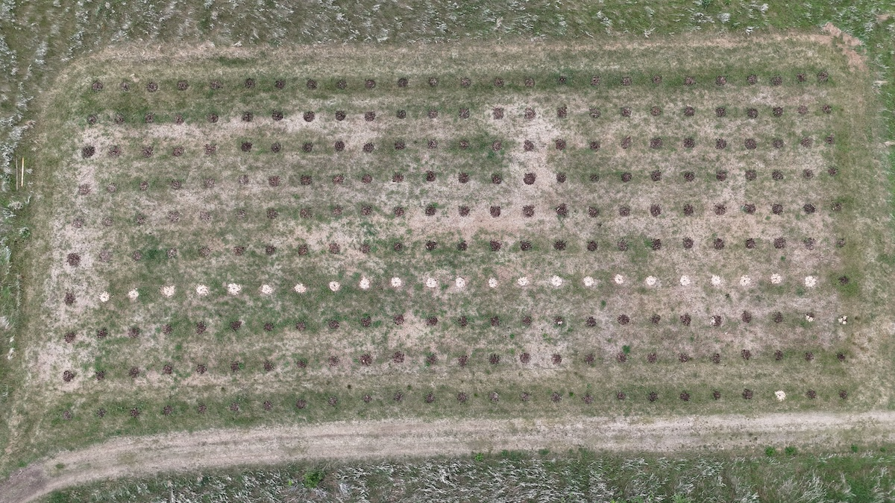
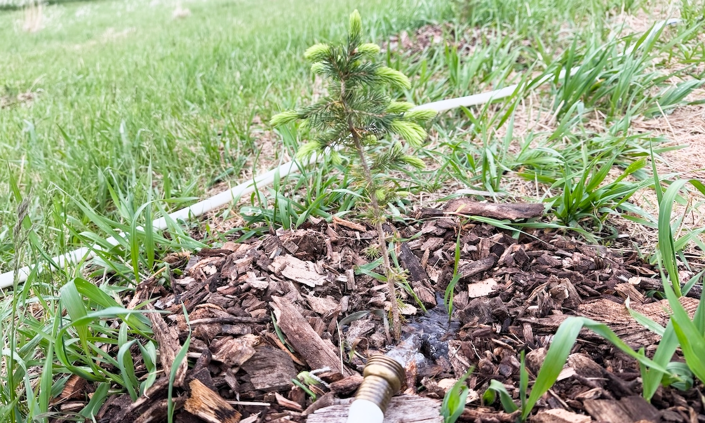
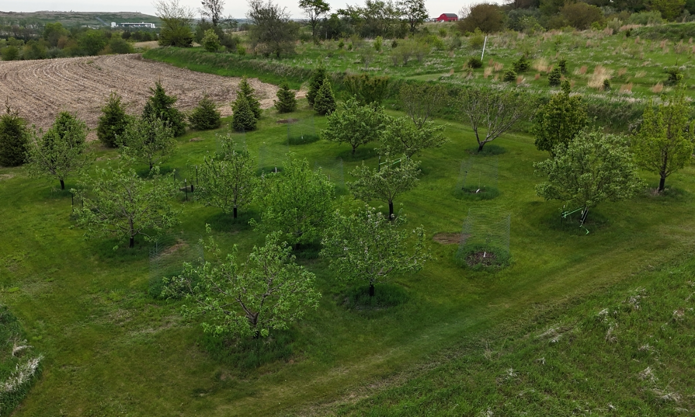

I guess I can't help myself. ¯\\_(ツ)_/¯

When I [retired from The Changelog](https://jerodsanto.net/2026/03/so-long-changelog/) two months back, the only real plan I had[^1] was to plant a little tree farm on our land.[^2] Check! ✅

It might not look like much,[^3] but that's 250 evergreen seedlings, planted and mulched.[^4] Oh, and watered. Sooo much water. 

I was going to install a drip system immediately, but that's an entirely different story. For now, it's been all manual watering, baby... 🚿

I enjoy the work tremendously. I knew I would. 

But what's surprised me has been that no matter how hard I try, when I'm out there with my hands in the dirt, literally touching grass... **I just can't stop thinking about software**.

Maybe it takes longer than two months to detox...

Maybe software is so pervasive that it's become unignorable...

Or maybe it's simply become **the way I'm wired** to think...

I dunno, but I can't seem to stop myself from pondering the digital world while working in the real world. Related: here's a list of things about planting trees that are similar to software projects...

- **Moore's law** – it won't rain when you want it to, but it certainly will when you don't want it to 😓
- **Dependency hell** – my fir tree supplier tried a new storage mechanism this winter. It didn't work. End result? I do have 250 planted trees, but I had to plant 350 (!) of them to get here 😭
- **Foundations matter** – the primary threat to seedlings is letting their roots dry out. Start wrong and you will undoubtedly be starting over 😔
- **Maintenance required** – unmaintained software is dying software and unmaintained trees are dying trees 😵
- **Big things start small** – watching small things grow into substantial things over time is one of my life's great joys[^5] 😊

Speaking to that last bullet point, I put a lot of work into the orchard this spring too. I had to re-plant seven apple trees after last summer's wind storm.

You can see what the entire orchard looked like not too long ago in this picture. Just imagine those fenced little trees in every spot!

Anyways, back to the topic of my software daydreams...

What does this all mean? I think it means I won't be switching industries anytime soon. I had toyed with the idea of trying something entirely different,[^6] but I don't think I have it in me. So what do I do about it? 🤔

In the near-term, I'm going to plant something small again. 

I want to help folks best use today's (amazing) tools to build simple systems that work **for** their business, not the other way around.

I'm formalizing that some and will say more soon, but you don't have to wait to [get in touch](mailto:jerod.santo@gmail.com). **Let's team up!**

I may be outside watering, but I'm sure to check my email between trees! 😉

[^1]:  In addition to my *substantial* honey-do list, which had built up from years of neglect
[^2]: People have asked me if this is a serious business. Not right now. Probably never. I think of it more like a hobby that will also make money, eventually. In the meantime, it's a great way to work alongside my kids and put our land to use. Also, I like trees.

[^3]: It'd look a lot cooler if I hadn't run out of mulch and had to finish with a different load. My perfectionist tendencies are almost always kept in check by the laws of physics. It's probably for the best...

[^4]: For the curious: 100 Concolor Fir (the "cadillac" of fir trees), 100 Colorado Blue Spruce (in highest demand), 50 Black Hills Spruce (my personal favorite)

[^5]: This applies to children, relationships, faith, athletics, hobbies, career... pretty much everything

[^6]: I've told my wife a million times that one day I'm going to just go become a garbage man. I think she called my bluff 🤣