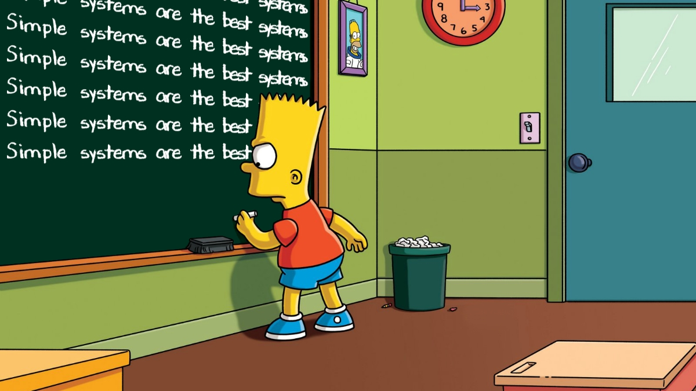

When it comes to systems design, [John Gall](https://en.wikipedia.org/wiki/John_Gall_(author)) knew his stuff. He even has a LAW[^1] about it:

> A complex system that works is invariably found to have evolved from a simple system that worked. A complex system designed from scratch never works and cannot be patched up to make it work. You have to start over with a working simple system.

Gall isn't the only promoter of simple systems. Here's [Dijkstra](https://en.wikipedia.org/wiki/Edsger_W._Dijkstra) (maybe you've heard of him?)

> Simplicity is a great virtue but it requires hard work to achieve it and education to appreciate it. And to make matters worse: complexity sells better.

I grew to appreciate simple systems through a painful process of creating (and then having to maintain) complex ones. 

I used to think that most software developers agreed with me on simplicity's value. [After spending 13 years interviewing](https://jerodsanto.net/2026/03/so-long-changelog/) the brightest minds in our industry, I've learned that most devs pay lip service to simplicity, but quickly ditch it at the first chance at "clever" or "elegant" alternatives.

Luke Plant described this well in his excellent post, [No one actually wants simplicity](https://lukeplant.me.uk/blog/posts/no-one-actually-wants-simplicity/):

> A lot of developers want simplicity in the same way that a lot of clients claim they want a fast website. You respond “OK, so we can remove some of these 17 Javascript trackers and other bloat that’s making your website horribly slow?” – no, apparently those are all critical business functionality.

Simplicity has a marketing problem. It's hard to achieve, but it *looks* easy. Unimpressive, even. 

In a humble attempt to convince you that simplicity is a virtue worth working toward, here's an unordered[^2] list of *impressively* simple systems that I think are great. Maybe you do too?

---

[The Unix Way](https://en.wikipedia.org/wiki/Unix_philosophy) – The system of thought that spawned the software tools movement that took over the open source world. With an emphasis on "building simple, compact, clear, modular, and extensible code that can be easily maintained and repurposed by developers other than its creators", the Unix Way produced a pipeline of tools that all do "one thing well" and compose so powerfully that even our AI agents love them.

[Markdown](https://daringfireball.net/projects/markdown/) – John Gruber's little "text-to-HTML conversion tool for web writers" lets you write using an easy-to-read, easy-to-write plain text format, then convert it to structurally valid HTML. But I don't have to tell you that. Markdown is now so universally used/beloved[^3] that it's become the de facto format for software tools (and LLMs) and the only system I've been writing in for well over a decade.

[JSON](https://www.json.org/json-en.html) – Crockford's driving principle behind the now-universal data interchange format was "radical subtraction." The website says, "It is easy for humans to read and write. It is easy for machines to parse and generate." People nitpick JSON to death,[^4] but that basic combination of *easies* had everyone flocking to JSON from their SOAP and XML hellscapes.

[Ruby](https://www.ruby-lang.org/en/) – My first love is still one of my favorite programming languages to this day. Now, I know what you might be thinking: "But Ruby is so complicated!" The implementation is, yes, but even Rob Pike (whose language I address below) says that "simplicity is the art of hiding complexity" and Ruby is *great* at hiding things (😉). While Ruby itself isn't the most simple system, it enables us to express ourselves simply. That's worth a lot!

[RSS](https://en.wikipedia.org/wiki/RSS) – When you build the word "Simple" right into the acronym, you know you're on to something... Publishers maintain a file on their website that adds an entry at the top when new content is available and interested parties check that file periodically, doing whatever they want with the information. It doesn't get much simpler than that. Google may have [killed](https://en.wikipedia.org/wiki/Google_Reader) RSS as a mainstream system of consumption[^5], but this simple tech underpins many parts of our lives.[^6]

[Go](https://go.dev) – Go was designed for large-scale software engineering, which is why its designers made explicit choices to keep the language small. It only has 25 keywords! You can pretty much learn it in an afternoon. There is only one loop construct that covers every iteration pattern[^7]. Go is so simple, in fact, that generics were famously absent for over a decade. The end result is a language that is easy to learn, highly legible, and loved by programmers[^8] around the world.

---

I could go on, but I have a [young tree farm](https://jerodsanto.net/2026/05/planting-trees-software-dreams/) to tend to. I'll leave you with this: Not every great system can be simple. But great systems start simple and stay simple as long as humanly possible.

[^1]: I often wonder how people feel when they write extensively on a subject for many years, but ultimately only one of their thoughts permeate our collective conscious enough to become enshrined as *LAW*. Grateful? Indifferent? Peeved that they didn't get to pick which idea stuck? Probably grateful. It's an honor to have a *LAW*. All I have so far is a [principle about chip dip](/2026/01/jerods-chip-dip-depletion-principle/)!

[^2]: Okay, it's not actually unordered. I like my lists `ORDER BY LENGTH(title) DESC`

[^3]: I bet Markdown's runaway success make's Gruber feel a lot like how [Glen Hansard described the world's response to the Oscar-winning song, "Falling Slowly"](https://youtu.be/mTwnhzrX4aU?si=32tgyqo16LrBOrML&t=500)

[^4]: Mostly because we now use it as a configuration file format in addition to a data interchange format. Config files need comments!

[^5]: Only us nerds still use RSS readers these days. For shame, they're so good!

[^6]: I love RSS so much, I named [my consultancy](https://reallysimple.systems) after it.

[^7]: As a functional programming fan, I don't love this about Go. But I respect i!

[^8]: Turns out Go's simple design makes AI coders love it too