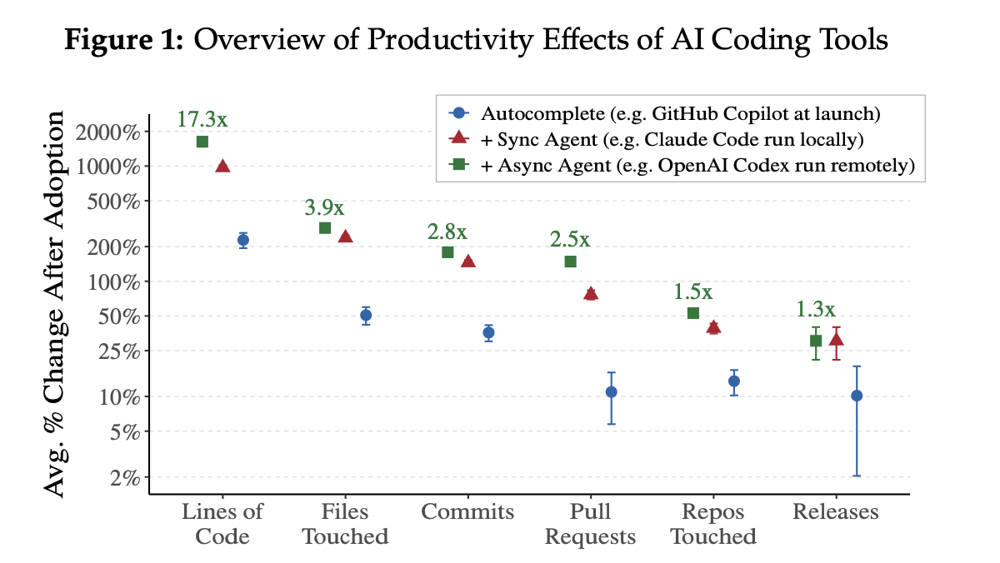

The [legendary adage](https://www.folklore.org/Real_Artists_Ship.html) Steve Jobs deployed to push the original Macintosh team over the finish line has outlived the hardware it helped ship. 

Had Apple's software engineers been equipped with AI coding agents back in 1983, much of the work would've been easier to accomplish. But shipping?! That's one thing AI isn't a huge help with (yet).

At least not according to [a new paper](https://www.nber.org/system/files/working_papers/w35275/w35275.pdf) that studied data on more than 100k GitHub developers combined with their AI usage telemetry. Here's the good news:

> In a matched event study design, we find that autocomplete, interactive coding agents, and autonomous coding agents each significantly increase coding activity (“commits”), with respective cumulative effects of 40%, 140%, and 180%.

But here's the bad news:

> These gains, however, attenuate sharply across the production hierarchy: the 180% cumulative effect falls to 50% for the number of projects, and to 30% for actual releases.

HUGE productivity boost, MINOR shipping boost.

This aligns with what I've been hearing from other devs and experiencing myself. Do I code faster than ever? Absolutely. But am I *shipping* more than ever? I can't say that I am...

So here's a reminder for the both of us: 

Real artists still ship. If **you** want to be an artist, **you** gotta ship!