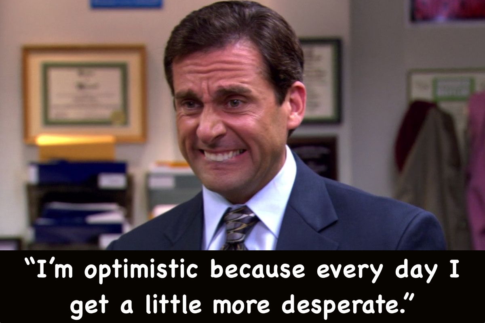
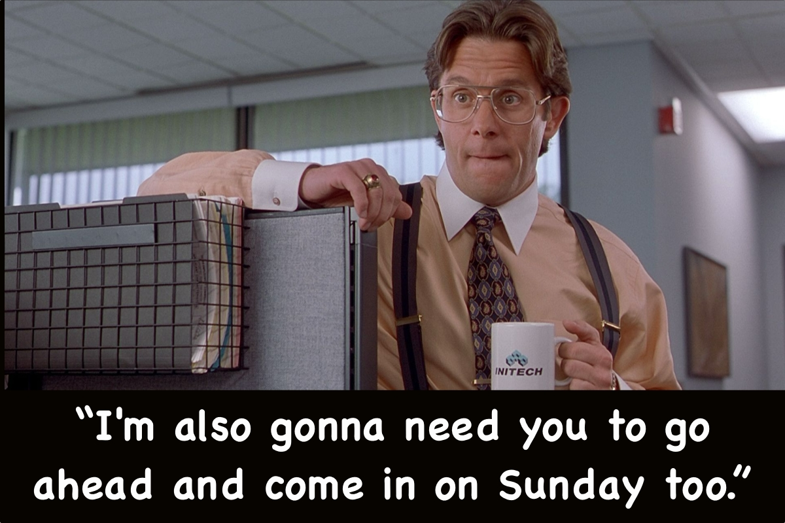

Sometimes, while agentic coding...

I feel like Michael Scott: Dunder Mifflin's best salesman who got [Peter principle'd](https://en.wikipedia.org/wiki/Peter_principle) into a management role[^1] he's kinda terrible at and now spends his days watching other people make all the sales calls.

Sometimes, while agentic coding...

I feel like Jean-Luc Picard: my childhood hero[^2] who always weighs the trade-offs, makes the tough decisions, and delegates the execution to competent subordinates.

This doesn't sit well with me.[^3] 

In an effort to feel less like one of my favorite office buffoons and more like one of my favorite Starfleet captains, I'm literally typing **"make it so"** to my agents now.

Is it helping? Maybe a *little*.

One piece of good news: thanks to the utter lack of agentic social lives, I have no problem pulling a Bill Lumbergh whenever I want.

[^1]: [The reason](https://www.youtube.com/watch?v=tqtFAqILoOw) he took the job is actually hilarious, no surprise
[^2]: Right alongside Michael Jordan, Ken Griffey Jr, and (regrettably) Zach Morris
[^3]: And it shouldn't! [A double minded man is unstable in all his ways](https://armorer.io/james/1/#8)