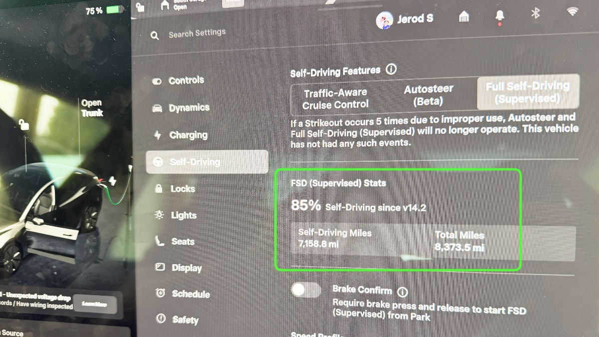

A year ago this week, I hopped a flight to Denver[^1] to pick up my shiny, new Tesla Model 3. The 8-hour ride[^2] home was a revelation.

---

I've never been a car guy for the same reason I've never been a fashion guy: I don't like superficial status games and there's few status games more superficial than what wheels you're driving or what heels you're wearing. 

I would opt out of *wheels and heels* entirely if it were possible. But a guy's got places to go and he better show up at those places with some clothes on or he creates much bigger problems.

For that reason, I've never had a fancy car. I've had nice cars. Serviceable cars. Get me to Point A from Point B without breaking down cars. But I've never wanted a fancy car because I don't want people to judge me[^3] before they get a chance to get to know me first. So why get a Tesla?!

I'm not a car guy, but **I am a computer guy**. With Tesla, "[everything's computer.](https://www.youtube.com/watch?v=5uPkOLr7Yjs)"

I've wanted one for a long time, because software. Also I hate stopping for gas. So it was meant to be. The first time I considered a purchase was circa 2015. They were more expensive then. I couldn't comfortably afford one. So I bought the stock instead.[^4] The purchase price has gone down a lot since then. The stock has moved aggressively in the opposite direction. Also they're less fancy than ever.[^5] Which brings us back to picking up my Model 3...

I was super nervous to let it drive itself at first. That lasted *maybe* 30 minutes. By the time I was clear of Denver traffic, cruising East on I-76, the nerves had all but vanished. The self-driving system worked *surprisingly* well. *Ridiculously* well. *Hard to believe* well. And that was a year ago. It's gotten a lot better since then. It continues to improve with each point release.

It's so good now that I only really drive in parking lots.[^6] I've logged over 7,000 miles with FSD so far and haven't had a singular dangerous moment.

There have been issues, of course, like bad map data causing errant navigational choices. But the core driving system is so solid I'm certain it's already safer when FSD is engaged than when I'm in charge.[^7] 

I'm in awe of the engineering required to pull this off. Kudos to the team!

The weirdest thing is there aren't too many Teslas around town[^8] and I read somewhere that only 20% of Teslas pay extra to have FSD. That means almost nobody on the road is having the same experience I'm having: just sitting there, drinking my coffee, daydreaming, working out hard problems, rubbernecking the view, or whatever suits my fancy.[^9]

In this one narrow way, it feels like I've been living in the future for the past year. So I traveled back in time to tell you it's pretty great!

[^1]: Why Denver? Because they were running a 0% financing offer, but only at official Tesla dealerships. Nebraska won't let Tesla have any presence here, because politics. There's a Tesla *Service Center* across the river in Council Bluffs, but that's not an official *dealership*, because politics. So, Denver it had to be!

[^2]: I use the word "ride" purposely, because I didn't drive myself home. I was just a (highly-invested) passenger. I've had a lot of fun with this wordplay around the house, turning my nose up at the mere *suggestion* that I drive somewhere. "I don't drive. [That's ghetto](https://www.youtube.com/watch?v=7VYkktkyf04)."

[^3]: I do understand this is an impossible desire and my wanting to opt out of the system entirely is, itself, a factor by which people judge. But that doesn't mean I can't try!

[^4]: The best investment thesis of my life has been: when I find myself loving (or desiring) a thing, don't buy the thing. Buy the stock. Then maybe buy the thing. Or don't. But I've never regretted buying the stock of a company whose product/service I truly love (or desire).

[^5]: Partly because they're more common. Partly because Elon Musk. I'm ambivalent on Elon. For instance, I agree with his position on population growth, but I find his personal approach to population growth abhorrent.

[^6]: They're still ironing out the 'last mile' stuff, such as which entrance you want to use at a large facility or how to pick a good parking spot. Just recently, they added a GUI for choosing between parking on the street, in the lot, or at a charger. I expect this is a stepping stone toward just talking to Grok and telling it your preference as the destination draws near.

[^7]: Unsurprisingly, I still disengage when I see a deer or a child on a bike as if my response time is superior to the computer's even though I can't hit a fast ball anymore like I could when I was 18.

[^8]: There's way more of them than there were five years ago, but my sons & nephews play a game where they call out Teslas on the road like we used to with VW Bugs (no slugs back!), so they aren't *too* common.

[^9]: En Vogue was right. [Free your mind](https://www.youtube.com/watch?v=i7iQbBbMAFE) and the rest will follow.