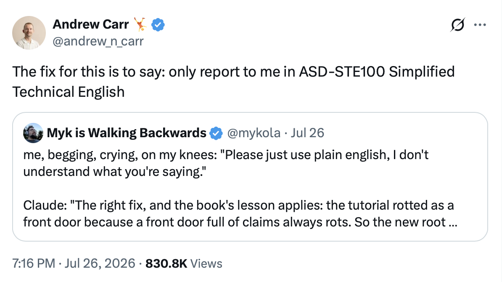

With every auto-update, Claude Code has gotten better at writing software. What it hasn't improved at, tragically, is *communicating* to me in a way that doesn't make me want to punch it square in the `/artifacts`

As I've [written](https://jerodsanto.net/2026/06/claudes-writing-style-has-me-on-edge/) before, Claude is finding its voice and I'm really happy for this important step in its life but also I hate its voice and I hope its voice dies in a fire. You know what I'm talking about. Monstrosities like this:

> It's not an edge case, it's an invariant violation quietly hiding at the boundary between individually reasonable assumptions, which is exactly why it matters.[^1]

I want Claude to keep writing software for me, but I'm done with:

- "smoking gun"
- "load baring"
- "honest opinion"
- "just say the word"
- "I have the full picture"
- "you're right to push back"
- "shapes the entire conversation"

Thank God, I recently stopped scrolling[^2] long enough to find this *one easy trick* that Andrew Carr [posted](https://x.com/andrew_n_carr/status/2081534245370314816) on X:

I had never even heard of [ASD-STE100](https://www.asd-ste100.org) before, but like most cool things in our industry, it goes back to the '70s. Here's all I needed to know:

>The STE standard consists of a set of writing rules and a controlled dictionary. The writing rules focus on grammar and style. The dictionary contains the approved words that a writer can use and a list of words that are not approved with related alternative suggestions.
>
>These approved words were selected because they were simple and easy to recognize. In general, each word has only one meaning and is approved with only one part of speech.

With that knowledge in hand, I fired up `claude` and typed:

> Make a memory to only report to me in ASD-STE100 Simplified Technical English

You're curious if it worked. *My honest opinion? I was right to push back...*

I'll spare you the Instagram influencer style before-and-after shots. You already have the *one easy trick* copied to your clipboard. 

All you have to do is go paste it.

[^1]: I yoinked that particular quote from [an Avy Faingezicht essay](https://faingezicht.com/articles/2026/08/14/the-bots-always-find-something/), because it triggered me, but examples are pervasive

[^2]: Two observed side effects of agentic coding vs hand typing every statement like the bad ol' days: 1. My brain hurts less at the end of each session. 2. I find myself surfing and scrolling the internet more often.
