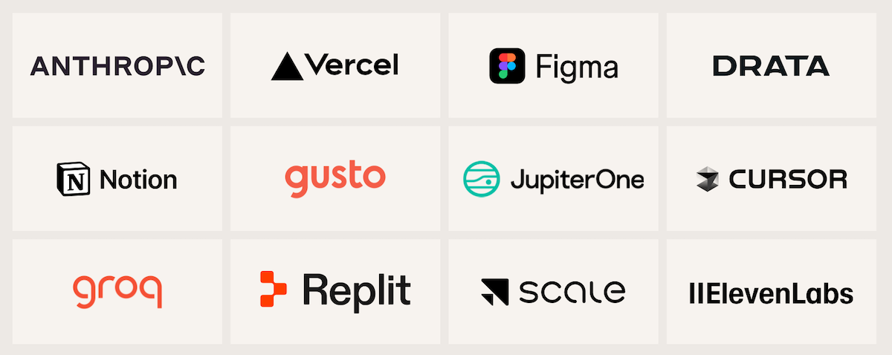

When I [said goodbye to The Changelog](https://jerodsanto.net/2026/03/so-long-changelog/) in March, people asked me about this bit:

> Part of me wants to go get a software engineering job. Part of me wants to keep creating content. Part of me wants to start a new software business. Then there’s a part of me that wants to just open a food truck and sell meatball sandwiches for a living!

After six months of [tree farming](https://jerodsanto.net/2026/05/planting-trees-software-dreams/), [consulting](https://reallysimple.systems), [watching movies](https://jerodsanto.net/2026/08/movie-theaters-are-so-back/), and *almost* getting a software engineering job... I decided that the *Meatball Sandwich Food Truck*[^1] will have to wait. Because!

I'm joining [Feross](https://feross.org) and the gang as *Head of Media* at [Socket](https://socket.dev) [(🥳)](https://www.youtube.com/watch?v=ChpmKkWBb4w)

## Why Socket

I've been a Feross fan for over a decade. His work on [Standard JS](https://standardjs.com) and [WebTorrent](https://webtorrent.io) was more than enough to get him invited on [The Changelog](https://changelog.com/podcast/227) back in 2016. In the opening of that show, I said this:

> (WebTorrent is) one of these things that makes you say, “I didn’t know you could even do that with web browsers.” Anytime somebody can put together interesting projects that stretch the limit of what we can do inside the browser, that gets our attention.

Turns out, “*I didn’t know you could even do that with web browsers*” was something I'd say about Feross' work[^2] for many, many years. In addition to his technical prowess, I just liked the guy. I liked him so much, in fact, that when we [rebooted JS Party](https://changelog.com/jsparty/20) in 2018, I invited him to be a regular panelist. Feross was key to JS Party's success.[^3] He even played a part in our [pièce de résistance](https://changelog.com/jsparty/155) 🎨

When Feross told me about Socket back when he was forming it, I knew it'd have a great shot at succeeding. Now that I've seen what he's built in six short years, I actually think this could become a *generational* security company.

They're [developer](https://socket.dev/love) first, open source native, proactive, and allergic to the dubious marketing practices I've come to associate with infosec firms. As a (tiny) angel [investor](https://socket.dev/about#investors) in Socket, I've been privy to their growth story and I'm beyond impressed by what this team has accomplished already. The logos on [socket.dev](https://socket.dev) don't tell the whole story, but they're a good indicator of the *quality* of the orgs that trust Socket with their supply chain security.

So, when Feross and [Sarah](https://www.linkedin.com/in/sarah-gooding/) reached out to me about joining the team and helping bootstrap their media strategy, I jumped at the opportunity.[^4]

## Why a jobby job

This may be news to you, but I haven't had a *Real Job* since 2012. I've been contracting, consulting, founding, and podcasting for the past 1.5 decades.

Stable income, health insurance, vacations, paid time off, and other benefits that W-2 employees take for granted are pretty attractive things that I have little experience with.

I'm not complaining. I opted out of those things because I value *freedom* and *autonomy* in my work more than anything else. But that doesn't mean I never looked at the other side of the fence[^5] and thought, "*that does look nice. I think I'd like to try that.*"

Covid changed a lot. Modern software orgs like Socket strike a nice balance of benefits with freedom by allowing remote work, making your own schedule, etc.

So, I'm trying it. And I'm excited about it! That's probably a rare sentiment coming from a 44 year-old guy who's been in the tech industry his entire career.

"*I get to have a boss?! And they like... give me direction?! Let's go!*" 🤣

## What's coming

Expect content! Sweet, sweet, *Jerod-crafted* content 🤲

I don't know exactly what form it will take: videos, podcasts, blogs, new things the kids are doing that I don't even know about yet... Who knows! We're exploring and experimenting as we go, but if you enjoy the stuff I create at all, I think you'll enjoy what I cook up at Socket.

In fact, I've cooked up [my first official post](https://socket.dev/blog/jerod-santo-joins-socket) on the Socket blog, in which I [allow myself to introduce... myself...](https://www.youtube.com/watch?v=evHIYJzp0OQ)

[^1]: I actually did look into this. Unfortunately, local regulations make it a pain to get started. For one, to operate a food truck you have to have access to a commercial kitchen. Lame. I still want to try it someday! I even own SantoSauce.com. But not today.

[^2]: See [Wormhole](https://wormhole.app),  [BitMidi](https://bitmidi.com/), and [The Annoying Site](https://github.com/feross/TheAnnoyingSite.com) for more mad science

[^3]: I've produced many award-*worthy* podcasts, but JS Party is one of only two award-*winning* podcasts on my podcaster resumé. Can you guess the other one?

[^4]: I'm told I can also do some Serious Engineering as opportunities arise. My eyes are peeled and my text editor is open...

[^5]: As the old saying goes: "The grass is always greener *where you water it*"
