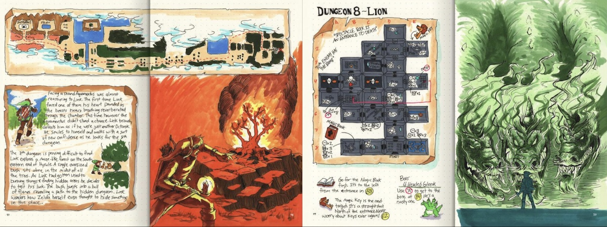
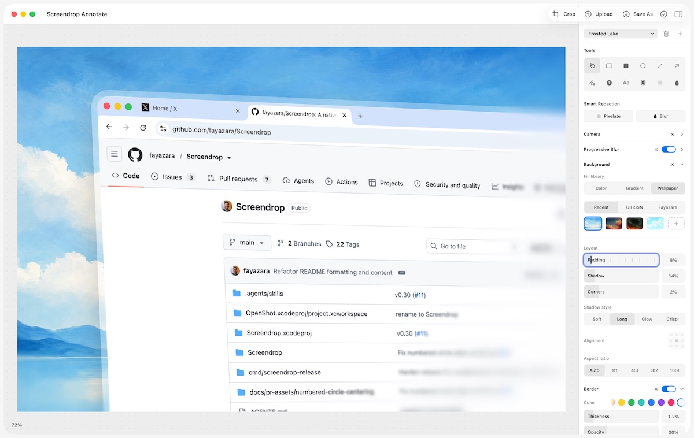

Here's a smattering of things I found interesting lately. Tools, articles, silos, and insults to all programmers.

---

[Silo](https://www.themoviedb.org/tv/125988-silo)

I haven't been this into a sci-fi / mystery box series since Lost.[^1] The setup:

> In a ruined and toxic future, thousands live in a giant silo deep underground. After its sheriff breaks a cardinal rule and residents die mysteriously, engineer Juliette starts to uncover shocking secrets and the truth about the silo.

I binged the first 3 seasons at an alarming rate. The season 3 finale was pure cinema and the final season teaser has me counting the days until "Summer 2027". Watch it!

[The bosses are coding again](https://blog.herlein.com/post/senior-engineers-coding-again/)

Greg Herlein counts himself among many software leaders (Kent Beck, Garry Tan, etc) who are shipping code once again:

> Somewhere in the last year, a bunch of us who hadn’t shipped real code in years quietly started shipping again. Not reviewing it. Not architecting it in a doc and handing it off. Actually building it. And loving it.

[A hand-drawn game guide of Legend of Zelda](https://archive.org/details/legend-of-zelda-hdgg-digital/page/n21/mode/2up)

Ten-year-old-me would've sliced off and sold one of his fingers[^2] to get his hands on a guide like this one by Phil Summers. So cool!

["Code was never the hard part" is an insult to all programmers](https://blog.senko.net/code-was-never-the-hard-part-is-an-insult-to-all-programmers)

Senko Rašić takes offense (for all of us) to the refrain: 

> “LLMs may be good at coding, but software was never the hard part” and “coding is easy, it's figuring out what to code that's hard”.

[MicroLighter](https://davatron5000.github.io/microlighter/)

Dave Rupert's new "tiny, dependency-free syntax highlighter for the web" takes advantage of the [CSS Custom Highlight API](https://developer.mozilla.org/en-US/docs/Web/API/CSS_Custom_Highlight_API) to deliver everything I ever wanted in a syntax highlighting solution. "It highlights code without adding a \<span\> around every token, so your markup stays clean and editable."

[Darkbloom](https://console.darkbloom.dev)

SETI@home but for AI? Get paid while people use your Apple Silicon Mac to serve AI models. The [earnings calculator](https://console.darkbloom.dev/earn) gives you an idea of how much you can make, but this is a network play and an early one, at that. They need both providers and users to show up before you can rely on any of these numbers being accurate.

[HTML can do that](https://chrisburnell.com/html-can-do-that/)

This page lists a bunch of dynamic functionality that we can now achieve with just HTML. Give it to your coding agent so it reinvents less wheels in JavaScript.

[Screendrop](https://github.com/fayazara/screendrop)

> A beautiful screenshot + screen recording + Loom alternative - all native, self hostable and free

[Three kinds of startups](https://blog.separateconcerns.com/2026-07-04-startup-kinds.html)

Pierre 'catwell' Chapuis says he's worked for three kinds of startups, and it's beneficial to put all startups in these buckets:

- hype-driven
- customer-driven
- value-driven

[Authorize, don't authenticate](https://blog.marcua.net/2026/07/31/authorize-dont-authenticate.html)

Here's a radically different approach to web apps:

> In traditional web applications, you authenticate with the application to log in/prove your identity. Only once you’ve proved yourself with a password/passkey/… can you get access to your data. That puts the application in charge of your data. Instead, you should authorize an application to get access to your personal database.

[Please use AI](https://shawnsmucker.substack.com/p/please-use-ai)

This lovely poem by Shawn Smucker isn't merely anti-AI. It is pro-human.

> But isn’t that, my flesh-and-blood friend,
> the natural order of things?
>
> the longing for something that could always be
> a bit better
>
> or the way that anything
> worth doing feels a bit clumsy and painful,
> especially at first
>
> or hearing another human voice and somehow
> realizing the beauty of life is found in all of these
> subtle imperfections

[Why Go is an ideal language for AI-assisted software engineering](https://developers.googleblog.com/why-go-is-an-ideal-language-for-ai-assisted-software-engineering/)

I surmised this might be the case and have been using Go quite a bit as a result of said surmising.[^3] But I'd never set out to make the case. In this post, a few members of the Go team do exactly that.

> Go, by contrast, was designed from day one to solve the challenges of large-scale, long-term collaboration. Its read-first clarity, production-readiness, and platform-wide consistency provide the exact deterministic guardrails required to absorb the high-velocity output of an AI teammate without sacrificing reliability, maintainability, or system integrity.

[Mailflare](https://mailflare.co)

A self-hosted, open-source email inbox for custom domains. It runs in your Cloudflare account and combines inbound routing, sending, storage and a web interface.

[Human slop](https://max.engineer/human-slop)

Max Chernyak is mad because AIs aren't the only ones churning out slop.

> To be clear, I have nothing against you soaring through your personal growth in a permanent state of child-like wonder like the absolute Peter Pan you are, learning profound wisdoms from every new shape of eye floater you’ve rubbed into your retina. Be you, king. But holy hell, why has it become the rite of passage for every clown promoting something to share daily life lessons on social media?

Warning: **this is a rant**. But it's a rant that I enjoyed the *poop* out of...

> I pooped today. Time to post a commencement speech on LinkedIn about prolonged gratitude, the importance of self-care, and the lessons learned from the humble act of defecation.

---

There it is. A smattering of things I found interesting lately. [How about you](/contact)?

[^1]: Lost hooked me with 2 amazing seasons, but epicly failed with unsatisfying (or non) answers to its many mysteries. I hope Silo delivers. It's based on a book series, so I think there's a good chance of landing the plane better than Lost did.

[^2]: But NOT his thumbs. He needed his thumbs to play moar Zelda

[^3]: The only place where Go fails for me right now is on Cloudflare, which prefers TypeScript for reasons unknown
